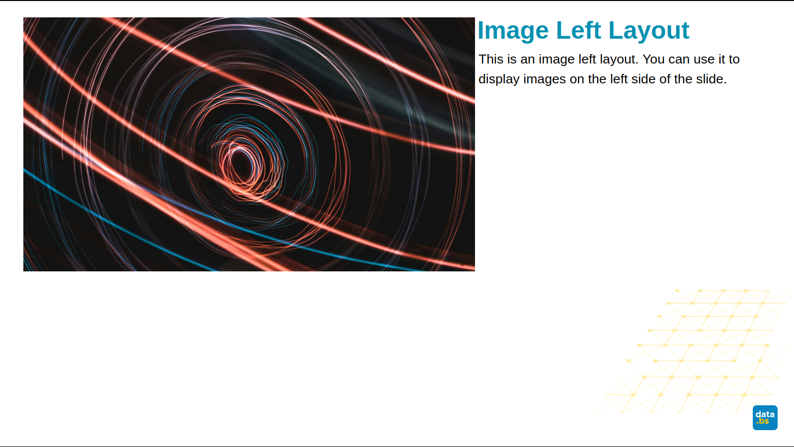

# Slidev Theme for DCC Basel-Stadt

A custom Slidev theme designed for presentations by the Department of Data and Statistics (DCC) of Basel-Stadt.

## Installation

### Using bun (recommended)

```bash
bun add git+https://github.com/DCC-BS/slidev-theme-dcc-bs.git#v0.0.1
```

### Using npm

```bash
npm install git+https://github.com/DCC-BS/slidev-theme-dcc-bs.git#v0.0.1
```

### Using yarn

```bash
yarn add git+https://github.com/DCC-BS/slidev-theme-dcc-bs.git#v0.0.1
```

Replace `v0.0.1` with the version you want to install.

## Usage

To use this theme in your Slidev presentation, add `theme: dcc-bs` to the frontmatter of your `slides.md` file:

```markdown
---
theme: dcc-bs
canvasWidth: 1920
mdc: true
---

# Your Presentation Title

Start your presentation here...
```

## Available Layouts

This theme provides several specialized layouts for different types of slides:

### Cover Layout


The main title slide with Basel-Stadt branding and background imagery.

```markdown
---
layout: cover
---

# Presentation Title
## Subtitle
```

### Intro Layout


Introduction slide with centered content and background graphics.

```markdown
---
layout: intro
---
# Intro
:: sub1 ::
sub1
:: sub2 ::
sub2
```

### Section Layout


Section divider slides to organize your presentation into chapters.

```markdown
---
layout: section
---

# Section Title
```

### Image Left Layout


Content layout with image positioned on the left side.

```markdown
---
layout: image-left
image: https://cover.sli.dev
---

# Content Title

Your content goes here while the image appears on the left.
```

### Image Right Layout


Content layout with image positioned on the right side.

```markdown
---
layout: image-right
image: https://cover.sli.dev
---

# Content Title

Your content goes here while the image appears on the right.
```

### Two Columns Layout


Split content into two equal columns.

```markdown
---
layout: two-cols
---

# Two Column Layout

::left::
Content for the left column

::right::
Content for the right column
```

### Blank Layout


Clean slate for custom content without predefined structure.

```markdown
---
layout: blank
---

# Custom Content

Design your slide exactly as needed.
```

### Additional Layouts

The theme also includes these layouts:

- **Default**: Standard content layout
- **Fact**: Highlight important facts or statistics
- **Quote**: Display quotes with proper styling
- **Statement**: Emphasize key statements or conclusions

## Development

To develop or customize this theme:

```bash
# Install dependencies
bun install

# Start development server
bun run dev

# Build the theme
bun run build
```

## License

This theme is created for the Department of Data and Statistics (DCC) of Basel-Stadt.

